# Edge Vision Lab

### 인천공항 CCTV Object Detection → 예지보전·운영 분석 데이터 준비


> **Domain goal**
>
> 인천공항 CCTV에서 탐지되는 사람·차량·수하물 등의 객체 데이터를 향후 예지보전·운영 분석의 입력 후보로 활용할 수 있도록, YOLO 기반 Object Detection 결과의 데이터 흐름과 API Contract를 학습합니다.

## Overview

인천공항 CCTV 객체 탐지 데이터를 향후 활용할 수 있다는 학습용 domain scenario에서, Python 기반 AI Vision 결과가 API response로 변환되는 과정을 직접 이해하고 재구성한 repository입니다.
Model Output과 API Contract 사이에 Adapter, Filtering, DTO 경계를 두었습니다.
최종 구현은 Mock Model Result를 사용하는 `POST /detections` Detection API입니다.
별도로 pretrained `yolo11n.pt` inference, `Results`/`Boxes`/Tensor 관찰, YOLO Adapter와 threshold 비교 실험을 수행했습니다.
실제 YOLO inference와 FastAPI API는 연결하지 않았습니다.

## Architecture

```mermaid
flowchart LR
    C[Client] --> R["DetectionRequest<br/>Pydantic Validation"]
    R --> E[FastAPI Endpoint]
    E --> M["Mock Model Output<br/>list[dict]"]
    M --> A["Adapter<br/>field mapping"]
    A --> F["Filtering<br/>confidence ≥ threshold"]
    F --> D["DetectionResult<br/>Pydantic DTO"]
    D --> H["HTTP JSON Response<br/>list[dict]"]

    classDef boundary fill:#EAF4FF,stroke:#3776AB,color:#172B4D
    classDef pipeline fill:#ECFDF3,stroke:#159957,color:#173D2A
    classDef contract fill:#FFF5E8,stroke:#D97706,color:#5E3800
    class C,H boundary
    class R,E,M,A,F pipeline
    class D contract
```



| Layer | Responsibility |
| --- | --- |
| Request DTO | `confidenceThreshold`의 type과 `0.0~1.0` 범위를 검증합니다. |
| Endpoint | 검증된 threshold와 Mock Model Result를 pipeline에 연결합니다. |
| Adapter | `xyxy → bbox`, `class_name → className`으로 Model Contract를 변환합니다. |
| Filtering | `confidence >= threshold` 정책으로 반환할 detection을 선택합니다. |
| DTO / FastAPI | 내부 `dict`를 `DetectionResult`와 HTTP JSON response로 변환합니다. |

## Core Implementation

- **Model → Service mapping**: `xyxy`, `class_name`을 `bbox`, `className`으로 변환합니다.
- **Separated responsibilities**: Adapter는 format conversion만, Filtering은 confidence policy만 담당합니다.
- **Service filtering**: 입력 순서를 유지하며 `confidence >= threshold` 결과만 새 목록으로 반환합니다.
- **Request validation**: `DetectionRequest`가 범위 밖 threshold를 Endpoint 실행 전 `422`로 차단합니다.
- **Thin Endpoint**: filtering loop와 DTO 생성 로직을 중복하지 않고 pipeline을 호출합니다.
- **Response contract**: `DetectionResult`는 `bbox`, `class_id`, `className`, `confidence`를 명시합니다.

## Actual YOLO vs Mock API

| | Actual YOLO experiment | Mock FastAPI API |
| --- | --- | --- |
| **Input** | pretrained `yolo11n.pt`와 이미지 1장 | 고정된 Mock Model Result 3건 |
| **Implemented** | `Results`/`Boxes`/Tensor 확인, YOLO Result Adapter, model/service threshold 비교 | Pydantic validation, Adapter, Filtering, `DetectionResult`, Endpoint |
| **Verification** | Fake YOLO `Results`로 Adapter와 Empty 결과 contract 테스트 | TestClient로 HTTP Happy / Empty / Invalid contract 테스트 |
| **Integration** | FastAPI와 연결하지 않음 | 실제 YOLO를 호출하지 않음 |

## Testing

`pytest`와 FastAPI `TestClient`로 service 및 HTTP contract를 검증합니다.

| Case | Request | Expected |
| --- | --- | --- |
| **Happy** | `confidenceThreshold: 0.7` | `200` + detections 2건 |
| **Empty** | `confidenceThreshold: 1.0` | `200` + `[]` |
| **Invalid** | `confidenceThreshold: 1.1` | `422` |

## Engineering Decisions

- **One vs. many**: Detection 한 건은 `dict`, 여러 건은 항상 순회 가능한 `list[dict]`로 다룹니다.
- **Empty is valid**: `None` 대신 정상 결과를 뜻하는 `[]`를 반환합니다.
- **Adapter is a boundary**: 모델 형식 변환만 담당하며 detection을 제거하지 않습니다.
- **Filtering is policy**: `confidence >= threshold`만 담당합니다.
- **Endpoint is thin**: HTTP boundary로 유지하고 Detection Logic은 pipeline에 둡니다.

> **Independent rebuild**
>
> 후반부에는 기존 답안을 보지 않고 요구사항에서 Input/Output Contract와 책임 경계를 먼저 정의한 뒤, 작은 Mock Detection API를 다시 구성했습니다. Happy, Empty, Invalid는 서로 다른 contract로 검증했습니다.

## Limitations

- FastAPI API는 고정된 Mock Model Result 기반입니다.
- Actual YOLO inference와 FastAPI는 연결하지 않았습니다.
- image upload 및 API 내부 OpenCV preprocessing은 구현하지 않았습니다.
- 인천공항은 학습용 domain scenario이며, 실제 CCTV 영상·RTSP 연결·공항 데이터를 사용하지 않았습니다.
- 예지보전용 시계열 데이터, 설비 ID, label, 예측 모델은 구현하지 않았습니다.
- YOLO training/fine-tuning, DB, 인증, deployment는 범위 밖입니다.
- bbox는 현재 `list[int]` 계약이므로 YOLO의 float 좌표 정밀도를 보존하지 않습니다.

## How to Run

현재 repository의 `practice/.venv` 환경 기준 PowerShell 명령입니다.

```powershell
# repository root → Week 1 tests
cd practice\week01
& ..\.venv\Scripts\python.exe -m pytest tests -q

# practice directory → Week 2~4 tests and Mock API
cd ..
& .\.venv\Scripts\python.exe -m pytest week02\tests week03\tests week04\tests -q
& .\.venv\Scripts\python.exe -m uvicorn week04.d31:app --reload
```
