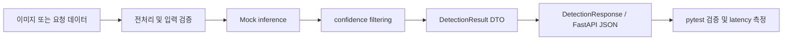

# Edge Vision Lab

AI Vision 결과를 서비스에 연결하는 과정을 작은 실습으로 익히는 학습 레포지토리입니다. 모델 연구나 완성형 서비스 구현보다 **이미지 입력 → 전처리 → 모의 추론 → 후처리 → DTO → API 응답 → 검증**의 흐름을 직접 설명하고 재구현하는 데 초점을 둡니다.

> 현재 학습 중인 기록입니다. 실제 YOLO 모델 운영이나 상용 환경 성능을 의미하지 않습니다.

## 학습 목표

- Python, NumPy, pandas를 사용해 이미지·탐지 결과 데이터의 구조를 이해합니다.
- OpenCV로 이미지의 `shape`, `dtype`, BGR/RGB, resize, crop 등 전처리의 기본을 실습합니다.
- Mock YOLO 결과를 `confidence`, `bbox`, `class_id`, `className` 기준으로 후처리합니다.
- Pydantic과 FastAPI로 탐지 결과의 요청·응답 계약을 만들고, pytest로 동작을 검증합니다.
- 추론 결과뿐 아니라 latency의 avg, max, p95 같은 기본 지표도 함께 확인합니다.

## 현재 학습 범위

| 구분 | 다루는 내용 |
| --- | --- |
| Python·데이터 처리 | `pathlib`, pandas filtering/groupby, NumPy `shape`·`dtype`, 간단한 시각화 |
| 이미지 전처리 | 이미지 읽기, BGR/RGB 변환, resize, crop, 입력 검증 |
| 추론 후처리 | mock inference, confidence filtering, `list[dict]` 결과 처리 |
| API·DTO | Pydantic request/response DTO, FastAPI endpoint, nested response |
| 검증·성능 | pytest happy/failure/empty case, latency avg·max·p95 |

## 학습 방식

각 주제는 아래 순서로 진행합니다.

1. 개념을 짧게 정리합니다.
2. 작은 함수와 테스트를 직접 작성합니다.
3. 원본을 보지 않고 review 파일로 다시 구현합니다.
4. 학습 노트에 데이터 흐름, 자료형, 실패 사례와 다음 복습 기준을 기록합니다.

AI의 도움은 개념 설명, TODO 설계, 코드 리뷰에 활용하되, 직접 구현한 범위와 학습 보조 범위는 각 학습 노트에 구분해 기록합니다.

## 학습 중인 핵심 흐름



실제 모델을 연결하기 전에는 mock 결과를 사용해 각 단계의 입력·출력 계약과 책임을 먼저 확인합니다.

## 디렉터리 구조

```text
practice/
├─ week01/                 # Python·데이터 처리와 OpenCV 기초
├─ week02/                 # 전처리, mock inference, filtering 흐름
└─ week03/                 # Pydantic DTO, FastAPI, latency, 응답 계약
   ├─ notes/               # 일별 학습 기록
   └─ tests/               # 실습 함수와 API 응답 검증

codex_airport_ai_vision_service_dev_8week_plan.md
                            # 전체 학습 방향과 이후 계획
```

## 실행 및 검증

가상환경을 활성화한 뒤, 각 주차의 실습 파일을 실행하거나 아래처럼 pytest를 실행합니다. Week 1의 초기 실습은 해당 주차 폴더를 기준으로 import하도록 작성되어 있어 검증 경로를 나누었습니다.

```powershell
# Week 1
cd practice\week01
& ..\.venv\Scripts\python.exe -m pytest tests -q

# Week 2~3
cd ..
& .\.venv\Scripts\python.exe -m pytest week02\tests week03\tests -q
```

학습 파일마다 필요한 라이브러리와 실행 예시는 해당 일자의 학습 노트에 함께 기록합니다.

## 현재 한계와 다음 단계

- 현재는 실제 YOLO/ONNX 모델, GPU 추론, 동시 요청 처리, 배포 환경 모니터링을 다루지 않습니다.
- 다음 단계에서는 지금까지의 전처리·후처리·DTO·API·측정 흐름을 하나의 작은 inference pipeline으로 재구성합니다.
- 이후 대표 프로젝트의 Data Flow와 현재 학습 내용을 연결해, 구현 범위와 한계를 설명할 수 있도록 정리할 예정입니다.

## 학습 기록

- [Notion 학습일지](https://app.notion.com/p/Python-AI-Vision-39626ace002380519feffb920be87df4?source=copy_link)
- [Portfolio](https://woongpro416.github.io/portfolio-web/)
