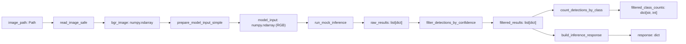

# Day 10 — 신뢰도 임곗값 필터링

## 문제

Mock inference가 반환한 모든 detection을 그대로 집계하거나 response에 넣으면 confidence가 낮은 결과도 다음 단계로 전달된다. 공항 CCTV·차량 카메라처럼 detection이 많은 서비스에서는 낮은 confidence 결과가 불필요한 알림이나 잘못된 집계로 이어질 수 있다.

## 해결 방법

`raw_results`에서 `confidence >= threshold`를 만족하는 detection만 새 list에 담는 postprocessing 함수를 구현했다.

```text
raw_results: list[dict]
  → filter_detections_by_confidence(raw_results, threshold)
  → filtered_results: list[dict]
```

- `confidence`: detection 하나에 대한 모델의 확신도인 `float`
- `threshold`: 통과를 위한 최소 confidence인 `float`
- 오늘의 규칙: `confidence >= threshold`
- `confidence == threshold`도 최소 기준을 만족하므로 포함한다.

## 데이터 흐름과 자료형 계약



| Function | Input | Return | Next use |
|---|---|---|---|
| `run_mock_inference` | `model_input: numpy.ndarray` | `raw_results: list[dict]` | filtering |
| `filter_detections_by_confidence` | `raw_results: list[dict]`, `threshold: float` | `filtered_results: list[dict]` | count and response |
| `count_detections_by_class` | `filtered_results: list[dict]` | `dict[str, int]` | verification / display |
| `build_inference_response` | `filtered_results: list[dict]` | `response: dict` | final result |

`raw_results`와 `filtered_results`는 같은 `list[dict]` 자료형이다. 차이는 `raw_results`가 모델의 전체 mock output이고, `filtered_results`는 confidence 조건을 통과한 subset이라는 점이다. 원본 list는 변경하지 않는다.

## 핵심 구현

`filter_detections_by_confidence(raw_results, threshold)`의 계약:

- `raw_results is None`이면 `ValueError`
- `raw_results`가 list가 아니면 `ValueError`
- `threshold is None`이면 `ValueError`
- threshold가 `0.0`보다 작거나 `1.0`보다 크면 `ValueError`
- 통과한 detection dict 전체를 새 `filtered_results` list에 `append()`
- `filtered_results`를 반환

`append()`는 list를 직접 변경하고 반환값은 `None`이다. 따라서 `filtered_results = filtered_results.append(detection)`처럼 대입하면 안 된다.

## 예시

```python
raw_results = [
    {"className": "vehicle", "confidence": 0.87},
    {"className": "person", "confidence": 0.42},
    {"className": "baggage", "confidence": 0.68},
]
threshold = 0.5
```

함수는 vehicle과 baggage detection만 포함한 `list[dict]`를 반환한다. person의 confidence는 `0.42`이므로 제외된다.

## 테스트

`week02/tests/test_d10.py`에 3개 pytest를 작성했고, 로컬 `.venv`에서 직접 실행해 `3 passed`를 확인했다.

```powershell
python -m pytest week02/tests/test_d10.py -q
```

| Test | Contract verified | Prevented bug |
|---|---|---|
| Happy path | threshold 이상 결과만 반환 | 낮은 confidence 결과가 남는 문제 |
| Boundary | `confidence == threshold` 포함 | `>`를 써서 경계값을 제외하는 문제 |
| Failure | threshold `1.1`에서 `ValueError` | 범위 밖 기준값이 조용히 통과하는 문제 |

## 나의 역할과 AI 학습 보조

- 직접 구현: filtering validation, 새 list 생성과 `for`/`if`/`append` filtering, Day 10 pipeline 연결, pytest의 input·expected result·assert 작성과 실행.
- AI 학습 보조: 함수 계약과 자료형 흐름 설명, 단계별 TODO 제공, 코드 리뷰, test file 구조 제공, testable import 위치 조정.

## 한계

- 실제 YOLO/ONNX 모델이 아니라 고정된 mock inference 결과를 사용한다.
- bbox, class ID, detection 내부 key의 상세 validation은 아직 구현하지 않았다.
- response에는 raw detection 수와 사용한 threshold를 포함하지 않는다.
- 현재 Codex 시스템 Python에는 OpenCV가 없어 image를 포함한 `main()` end-to-end 실행은 이 환경에서 재검증하지 않았다. Filtering unit tests는 OpenCV 없이 실행 가능하도록 분리했다.

## 다음 단계

1. OpenCV가 설치된 로컬 interpreter에서 `main()` end-to-end 실행을 다시 확인한다.
2. Day 11에 review 파일의 `main()`을 보지 않고 다시 연결한다.
3. 이후 response에 `rawDetectionCount`와 `confidenceThreshold`를 추가하는 작은 확장을 검토한다.

## 면접식 설명

Mock inference 결과를 confidence threshold로 postprocessing하고, 통과한 detection만 class별 집계와 response 생성에 전달했습니다. 경계값 포함 규칙과 잘못된 threshold 입력을 pytest로 검증했습니다.
