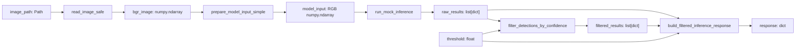

# Day 11 — Filtered inference response contract

## Goal

Day 10의 confidence filtering 뒤에 남은 detection만 서비스 결과로 사용하고, filtering 전후의 정보를 함께 기록하는 response를 만들었다. 실제 YOLO 모델이나 FastAPI는 연결하지 않고, 기존 mock inference pipeline을 재구성했다.

## Study journal

- `raw_results`는 mock inference가 처음 반환한 전체 detection이고, `filtered_results`는 confidence threshold를 통과한 결과다.
- detection이 한 개여도 detection 묶음의 계약을 유지하므로 `list[dict]`를 사용한다. 빈 결과도 `None`이 아니라 정상적인 빈 list `[]`다.
- response에는 결과뿐 아니라 raw 개수, filtered 개수, 적용 threshold를 포함해 filtering 기준을 추적할 수 있게 했다.
- response builder는 입력을 검증하고 response를 조립하며, `main()`은 이미지부터 response까지 pipeline을 연결한다.
- pytest 3개로 정상 결과, 빈 filtering 결과, 잘못된 길이 관계를 검증했다.

## Data flow



## Variables and roles

| Variable | Type | Purpose |
|---|---|---|
| `image_path` | `Path` | Input image location |
| `bgr_image` | `numpy.ndarray` | Original OpenCV BGR image |
| `model_input` | `numpy.ndarray` | Resized RGB image for mock inference |
| `raw_results` | `list[dict]` | All detections returned before filtering |
| `threshold` | `float` | Minimum confidence allowed by filtering |
| `filtered_results` | `list[dict]` | Detections whose confidence is at least threshold |
| `class_counts` | `dict[str, int]` | Count of filtered detections by `className` |
| `response` | `dict` | Final service-facing result and metadata |

## Response contract

```python
{
    "status": "OK",
    "rawDetectionCount": 2,
    "detectionCount": 1,
    "confidenceThreshold": 0.8,
    "classCounts": {"vehicle": 1},
    "results": [{"className": "vehicle", "confidence": 0.87}],
}
```

| Field | Data source | Reason |
|---|---|---|
| `status` | Fixed value `"OK"` | Indicates a successful response |
| `rawDetectionCount` | `len(raw_results)` | Shows how many detections existed before filtering |
| `detectionCount` | `len(filtered_results)` | Shows how many detections the service will use |
| `confidenceThreshold` | `threshold` | Records the criterion used for this result |
| `classCounts` | `count_detections_by_class(filtered_results)` | Summarizes usable detections by class |
| `results` | `filtered_results` | Returns only detections that passed the criterion |

`rawDetectionCount` and `detectionCount` are intentionally different. The first is the model's raw output count; the second is the count after postprocessing.

## Core implementation

Implemented `build_filtered_inference_response(raw_results, filtered_results, threshold)` with this contract:

1. Reject `None` and non-list values for both result collections.
2. Reject a missing threshold or a threshold outside `0.0` to `1.0`.
3. Reject a `filtered_results` list longer than `raw_results`.
4. Count classes from `filtered_results`.
5. Build and return the metadata response dict.

The function does not yet verify that every filtered dict is an exact member of the raw list. Today’s contract only verifies the safe length relationship.

## Run result

With the Day 09 mock results and `threshold = 0.8`:

```text
rawDetectionCount = 2
detectionCount = 1
classCounts = {"vehicle": 1}
```

```powershell
python -m week02.d11
```

## Testing

```powershell
python -m pytest week02/tests/test_d11.py -q
```

Result: `3 passed`.

| Test | Input and expected result | Bug prevented |
|---|---|---|
| Happy path | Raw 2, filtered 1, threshold 0.8 → counts 2 and 1 | Mixing raw and filtered metadata |
| Empty filtered results | Raw detections exist, filtered list is `[]` → `status="OK"`, count 0, empty class counts | Treating no passed detections as an error |
| Invalid contract | Filtered length is greater than raw length → `ValueError` | Returning an impossible postprocessing result |

## Review exercise

In `d11_review.py`, I rebuilt only these two blocks without recreating all earlier functions:

- `build_filtered_inference_response()`
- `main()` connection from `Path` through `raw_results`, `filtered_results`, and final `response`

The review execution returned the expected response with raw count 2 and filtered count 1.

## My role and AI assistance

- Direct implementation: pipeline connection in `main()`, response builder validation and field mapping, response assertions, three pytest cases, and the review reconstruction.
- AI-assisted learning: function contracts, small TODO steps, code review, pytest structure guidance, and error diagnosis.

## Airport monitoring connection

For an airport CCTV or vehicle-camera service, recording raw count, filtered count, threshold, and class counts helps operators investigate a sudden detection change. It separates a change in model output from a change caused by postprocessing policy.

## Limitations and next step

- This uses fixed mock inference results, not YOLO or ONNX.
- Detection dictionaries currently contain only `className` and `confidence`; bbox and class ID are out of scope.
- There is no detailed subset validation between raw and filtered results.
- The next step should remain focused on response and pipeline review before adding a real model or API.

## Interview explanation

"I separated raw inference output from confidence-filtered results, then returned both the usable detections and metadata such as raw count, filtered count, threshold, and class counts. I tested normal, empty, and invalid filtering contracts with pytest."

## Suggested commit message

```text
feat: add filtered inference response metadata and tests
```

## Day 12 review questions

1. What is the purpose difference between `raw_results` and `filtered_results`?
2. Why is one detection represented as `list[dict]` instead of only `dict`?
3. Why is `filtered_results = []` a normal result while `filtered_results = None` is an error?
4. Which input creates each of `rawDetectionCount`, `detectionCount`, and `confidenceThreshold`?
5. What bug does the test for a filtered list longer than the raw list prevent?
