# Day 12 — Pydantic Filtered Inference Response DTO

## 목표

Day 11에서 만든 filtered inference response dict를 Pydantic DTO로 검증했다. FastAPI endpoint나 실제 YOLO 모델은 추가하지 않고, mock inference pipeline의 마지막에 response contract를 명시했다.

## 학습 기록

- `response_data`는 Day 11 response builder가 만든 검증 전 `dict`이고, `response_model`은 Pydantic 검증을 통과한 `InferenceResponse` 객체다.
- `InferenceResponse(**response_data)`는 dict의 key-value를 keyword argument로 전달해 model instance를 생성하고, 이 순간 field type과 `Field` 제약을 검증한다.
- `rawDetectionCount`와 `detectionCount`는 `Field(ge=0)`으로 음수를 막고, `confidenceThreshold`는 `Field(ge=0.0, le=1.0)`으로 0.0~1.0 범위를 유지한다.
- `model_dump()`는 검증을 마친 model의 field 값을 새 dict로 반환한다. 원본 `response_model`의 자료형은 계속 `InferenceResponse`다.
- `ValidationError`는 DTO 생성 시 계약 위반으로 발생한다. 기존 Day 10 filtering 함수의 잘못된 threshold는 Pydantic 이전 단계에서 `ValueError`를 발생시킨다.

## 데이터 흐름

```mermaid
flowchart LR
    A["image_path: Path"] --> B["read_image_safe"]
    B --> C["bgr_image: numpy.ndarray"]
    C --> D["prepare_model_input_simple"]
    D --> E["model_input: RGB numpy.ndarray"]
    E --> F["run_mock_inference"]
    F --> G["raw_results: list[dict]"]
    G --> H["filter_detections_by_confidence"]
    T["threshold: float"] --> H
    H --> I["filtered_results: list[dict]"]
    G --> J["build_filtered_inference_response"]
    I --> J
    T --> J
    J --> K["response_data: dict"]
    K --> L["InferenceResponse(**response_data)"]
    L --> M["response_model: InferenceResponse"]
    M --> N["model_dump()"]
    N --> O["serialized_response: dict"]
```



## 변수와 역할

| 변수 | 자료형 | 역할 |
|---|---|---|
| `raw_results` | `list[dict]` | filtering 전의 전체 mock detection |
| `filtered_results` | `list[dict]` | threshold를 통과한 detection |
| `response_data` | `dict` | response DTO에 전달할 입력 데이터 |
| `response_model` | `InferenceResponse` | 검증을 통과한 response DTO |
| `serialized_response` | `dict` | `model_dump()`가 반환한 DTO 데이터 |

## Response DTO 계약

```python
{
    "status": "OK",
    "rawDetectionCount": 2,
    "detectionCount": 1,
    "confidenceThreshold": 0.8,
    "classCounts": {"vehicle": 1},
    "results": [{"className": "vehicle", "confidence": 0.87}],
}
```

| field | 자료형 | 제약 | 목적 |
|---|---|---|---|
| `status` | `str` | 오늘은 없음 | 처리 상태 |
| `rawDetectionCount` | `int` | `ge=0` | filtering 전 detection 수 |
| `detectionCount` | `int` | `ge=0` | filtering 후 detection 수 |
| `confidenceThreshold` | `float` | `ge=0.0`, `le=1.0` | 적용한 filtering 기준 |
| `classCounts` | `dict[str, int]` | 오늘은 없음 | class별 filtered detection 수 |
| `results` | `list[dict]` | 오늘은 없음 | filtered detection 목록 |

`ge`는 greater than or equal to, 즉 이상을 뜻하고 `le`는 less than or equal to, 즉 이하를 뜻한다.

## 핵심 구현

`week03/d12.py`에 `InferenceResponse(BaseModel)`을 구현했다.

1. Day 11 pipeline을 재사용해 정상 `response_data` dict를 생성했다.
2. `response_model = InferenceResponse(**response_data)`로 response contract를 검증했다.
3. 검증 후 `response_model.detectionCount`처럼 attribute access를 사용했다.
4. `serialized_response = response_model.model_dump()`로 이후 JSON/API 단계에서 쓸 dict를 만들었다.
5. 정상 response data를 복사한 뒤 `confidenceThreshold`만 `1.1`로 바꾸고 `ValidationError`를 확인했다.

오늘 `results`는 `list[dict]`로 유지했다. 결과가 dict의 list인지는 확인하지만 `className`, `confidence` 같은 내부 key는 검증하지 않는다. 내부 detection DTO는 의도적으로 Day 12 범위에서 제외했다.

## 실행 결과

전체 pipeline은 `practice` 디렉토리에서 module로 실행했다.

```powershell
python -m week03.d12
```

```text
<class '__main__.InferenceResponse'>
2
1
<class 'list'>
confidenceThreshold validation failed
```

`week03` 안에서 파일을 직접 실행하지 않고 `python -m week03.d12`를 사용한 이유는, Python이 `practice`를 import 기준 경로로 잡아 형제 package인 `week01`, `week02`를 찾게 하기 위해서다.

## 테스트

`week03/tests/test_d12.py`에 DTO 중심 pytest 3개를 작성했다.

```powershell
python -m pytest week03/tests/test_d12.py -q
```

결과: `3 passed`.

| 테스트 | 검증한 계약 | 막아내는 버그 |
|---|---|---|
| 정상 response | 정상 response가 예상 field를 가진 DTO를 생성한다 | field mapping 또는 response 구조가 조용히 바뀌는 문제 |
| 잘못된 threshold | `confidenceThreshold=1.1`에서 `ValidationError` 발생 | 범위 밖 filtering policy가 다음 시스템으로 전달되는 문제 |
| 잘못된 detection count | `detectionCount=-1`에서 `ValidationError` 발생 | 음수 detection 수가 다음 시스템으로 전달되는 문제 |

## 복습 구현

`d12_review.py`에서는 Day 06~11 함수를 import하지 않고 아래 블록만 다시 작성했다.

- `InferenceResponse(BaseModel)` field 계약
- `response_data`에서 `response_model`로의 변환
- `response_model`에서 `serialized_response`로의 `model_dump()` 변환

복습 파일 실행 결과도 예상한 serialized response dict였다.

## 나의 역할과 AI 학습 보조

- 직접 구현: `InferenceResponse` field와 제약, Day 11 pipeline 연결, DTO 생성, 직렬화, 정상 assert, failure case try/except, pytest 3개, review 재구현.
- AI 학습 보조: data flow 설명, class와 main block TODO, 계약 중심 코드리뷰, import path 오류 진단, pytest 구조 안내.

## 공항 관제 연결

공항 CCTV 또는 차량 탐지 서비스에서 response DTO는 음수 detection count나 범위 밖 threshold가 dashboard, alert system, database, 다른 backend service로 전달되는 일을 막는다. 검증을 통과한 response만 이후 FastAPI layer의 전달 데이터가 된다.

## 제한 사항과 다음 단계

- 아직 고정된 mock inference 결과를 사용하며 YOLO나 ONNX는 연결하지 않았다.
- FastAPI endpoint, HTTP response, router, database는 구현하지 않았다.
- `results` 내부 dict key는 nested DTO로 검증하지 않는다.
- `classCounts` value는 int type이지만 오늘은 음수가 아닌지 별도 제약을 두지 않았다.
- 다음 단계도 실제 모델이나 고급 validation으로 넓히기보다, 기본 Pydantic/FastAPI response 연결에 집중한다.

## 면접식 설명

"Mock inference postprocessing 뒤에 Pydantic response DTO를 추가해 detection count와 confidence threshold 계약을 검증하고, 검증된 객체를 향후 API response용 dict로 직렬화했습니다. 정상 데이터와 두 개의 잘못된 계약을 pytest로 확인했습니다."

## 추천 commit message

```text
feat: add Pydantic inference response DTO validation
```

## Day 13 복습 질문

1. Pydantic은 어느 표현식에서 response input을 검증하는가?
2. `response_data`, `response_model`, `serialized_response`의 역할은 각각 무엇인가?
3. 이후 JSON/API 단계 전에 `model_dump()`가 필요한 이유는 무엇인가?
4. `Field`의 `ge`, `le`는 `InferenceResponse`에서 무엇을 막는가?
5. Day 10은 잘못된 filtering argument에 `ValueError`를 쓰고 Day 12는 잘못된 DTO data에 `ValidationError`를 쓰는 이유는 무엇인가?
