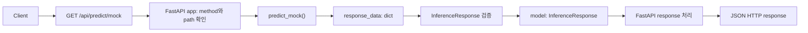

# Day 13 — FastAPI 첫 엔드포인트와 응답 모델

## 목표

Day 12에서 검증한 `InferenceResponse` DTO를 FastAPI GET endpoint의 response contract로 연결했다. 실제 YOLO나 이미지 업로드는 추가하지 않고, 고정된 mock response를 HTTP JSON으로 반환하는 흐름에만 집중했다.

## 핵심 구현

- `week03/d13.py`에 `FastAPI()` app instance를 만들었다.
- `GET /api/predict/mock`를 `predict_mock()` endpoint function에 연결했다.
- endpoint에서 `response_data` dict를 만들고 `InferenceResponse(**response_data)`로 검증한 model을 반환했다.
- `response_model=InferenceResponse`로 HTTP response contract와 OpenAPI schema를 명시했다.
- `GET /health`를 개념 확인용 endpoint로 실행했다.

## FastAPI 요청 흐름



## 역할과 자료형 구분

| 구분 | 예시 | 역할 |
|---|---|---|
| FastAPI 개념 | `GET`, path, decorator, endpoint, `response_model` | 요청을 endpoint에 연결하고 HTTP response를 처리한다. |
| 프로젝트 이름 | `app`, `predict_mock`, `response_data`, `model` | 이 프로젝트에서 정한 변수와 함수 이름이다. |
| Pydantic DTO | `InferenceResponse` | response data의 field와 제약을 검증하는 class다. |
| Python 자료형 | `dict` | `response_data`와 `response.json()`의 자료형이다. |

`model = InferenceResponse(**response_data)`에서 `model`은 변수 이름이고, 그 값의 자료형은 `InferenceResponse`다. `response_data`는 변수 이름이고, 그 값의 자료형은 `dict`다.

## 엔드포인트 반환값과 HTTP 응답

| 단계 | 값 | 자료형 |
|---|---|---|
| endpoint 내부 입력 | `response_data` | `dict` |
| DTO 생성 결과 | `model` | `InferenceResponse` |
| endpoint 반환값 | `model` | `InferenceResponse` |
| client 수신값 | HTTP response body | JSON object |
| 테스트에서 `response.json()` 호출 결과 | `body` | `dict` |

endpoint는 `InferenceResponse` model을 반환하고, FastAPI가 이를 JSON HTTP response로 변환한다. 따라서 endpoint가 Python dict를 직접 client에 전달하는 것으로 이해하면 안 된다.

## 경로 오류와 DTO 오류

| 상황 | endpoint 실행 여부 | 오류 위치 | 결과 |
|---|---:|---|---|
| `GET /api/predict/unknown` | 실행 안 함 | FastAPI route 확인 | 404 Not Found |
| `confidenceThreshold = 1.1` | 실행함 | `InferenceResponse(**response_data)` | validation error |
| `results`에 set을 넣음 | 실행함 | `InferenceResponse(**response_data)` | validation error |

잘못된 path는 endpoint에 도달하지 못한다. 반면 response data가 DTO 계약을 어기면 endpoint 내부의 DTO 생성 단계에서 멈춘다.

## 기존 AI 파이프라인과 FastAPI 계층

```text
Day 06~12
image → preprocessing → mock inference → filtering → response_data

Day 13
HTTP request → route → endpoint → InferenceResponse → JSON response
```

FastAPI는 inference나 filtering logic을 대체하지 않는다. 기존 AI pipeline이 `response_data`를 만들고, FastAPI endpoint는 검증된 결과를 HTTP JSON으로 외부 client에 전달한다. 나중에 고정 mock dict를 Day 06~12 pipeline 결과로 바꾸더라도 app, path, `response_model`, JSON response 구조는 유지된다.

## 실행과 문서 확인

`practice` 디렉터리에서 다음 명령으로 개발 서버를 실행했다.

```powershell
.\.venv\Scripts\python.exe -m uvicorn week03.d13:app --reload
```

- `GET /health`는 200 OK를 반환했다.
- `GET /api/predict/mock`는 `InferenceResponse` field를 포함한 JSON을 200 OK로 반환했다.
- `/docs`에서 `InferenceResponse` response schema를 확인했다.
- `/favicon.ico`의 404는 브라우저가 자동 요청한 아이콘 경로에 endpoint가 없어서 발생한 정상적인 결과다.

## 테스트

`week03/tests/test_d13.py`에 TestClient 테스트 2개를 작성했다.

```powershell
.\.venv\Scripts\python.exe -m pytest week03/tests/test_d13.py -q
```

결과: `2 passed`.

| 테스트 | 검증 내용 | 막아내는 문제 |
|---|---|---|
| 정상 mock prediction | 200 status와 response field 값 | response contract 또는 mock 결과가 조용히 바뀌는 문제 |
| 존재하지 않는 path | `/api/predict/unknown`의 404 | 잘못된 path가 endpoint에 연결되는 문제 |

TestClient는 별도 Uvicorn 서버 없이 test code에서 app에 HTTP 요청을 보내고, `response.status_code`는 `int`, `response.json()`은 Python `dict`로 확인하게 해 준다.

## 환경에서 확인한 점

- 기존 `venv`에는 Python 실행 파일이 없어 사용할 수 없었다.
- `.venv`에 FastAPI와 Uvicorn을 설치해 개발 서버를 실행했다.
- 현재 Starlette TestClient가 요구한 `httpx2`를 추가해 TestClient 테스트를 실행했다.

## 나의 역할과 AI 학습 보조

- 직접 구현: app instance, `/health`, `/api/predict/mock`, `response_data`, DTO 생성과 반환, TestClient 테스트 2개, review endpoint 재작성.
- AI 학습 보조: FastAPI 요청 흐름 설명, route·DTO 오류 위치 구분, 코드 리뷰, 개발 환경과 TestClient 의존성 진단, 복습 질문 제공.

## 공항·관제 연결

관제 Dashboard, Alert System, Spring Backend 같은 외부 시스템은 Python 함수를 직접 호출하는 대신 HTTP endpoint를 호출할 수 있다. `response_model`은 이 시스템들이 받는 JSON response의 field와 구조를 명확하게 고정하는 계약이 된다.

## 면접식 설명

"기존 mock inference 결과를 Pydantic `InferenceResponse`로 검증한 뒤, FastAPI GET endpoint와 `response_model`로 연결해 JSON API로 노출했습니다. Swagger 문서와 TestClient를 사용해 정상 200 response와 잘못된 path의 404를 확인했습니다."

## 다음 복습 질문

1. `app`, path, decorator, endpoint function의 역할은 각각 무엇인가?
2. endpoint return value와 HTTP JSON response는 무엇이 다른가?
3. `response_data`, `model`, `response.json()`의 자료형은 각각 무엇인가?
4. `/api/predict/unknown`과 잘못된 `response_data`는 각각 어느 단계에서 실패하는가?
5. 실제 AI pipeline을 연결할 때 바뀌는 부분과 유지되는 FastAPI 부분은 무엇인가?
