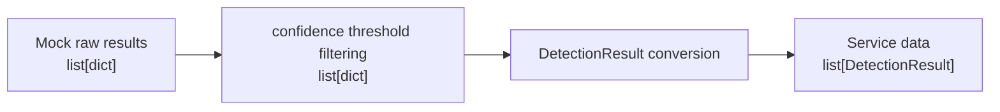

# Day 16 학습일지 — Mock YOLO Detection Output을 DetectionResult DTO로 변환

## 1. 오늘 목표

Mock detection 결과를 그대로 외부에 전달하지 않고, threshold filtering 뒤 `DetectionResult` DTO로 변환한다.

## 2. DetectionResult가 필요한 이유

모델 또는 라이브러리의 raw dict 구조가 바뀌어도 서비스와 Dashboard가 바로 깨지지 않도록, 서비스가 사용할 필드·타입·범위를 명시한다.

## 3. Detection 하나가 가진 정보

- `bbox`: 객체가 화면에 있는 위치
- `class_id`: 모델과 코드가 쓰는 클래스 번호
- `className`: 사람이 읽는 클래스 이름
- `confidence`: detection 하나에 대한 모델의 확신 값

## 4. bbox

오늘 bbox 형식은 `[x1, y1, x2, y2]`이다. `[120, 80, 300, 220]`에서 `(120, 80)`은 왼쪽 위, `(300, 220)`은 오른쪽 아래 좌표다. bbox는 객체 종류가 아니라 위치를 표현한다.

## 5. class_id와 className

`class_id=0`은 모델·코드가 클래스 구분에 사용하고, `className="vehicle"`은 API 응답·로그·Dashboard가 사람이 읽기 위해 사용한다.

## 6. confidence와 threshold

`confidence`는 detection 하나의 속성이다. `threshold`는 여러 detection 중 서비스에 포함할 결과를 고르는 기준이다. 예를 들어 threshold가 `0.8`이면 vehicle `0.87`은 남고 person `0.76`은 제외된다.

## 7. Mock Raw Output

오늘의 raw output은 실제 YOLO 라이브러리의 정확한 반환값이 아니라, detection 한 건을 연습하기 위해 단순화한 `list[dict]` 데이터다.

```python
[
    {"bbox": [120, 80, 300, 220], "class_id": 0, "className": "vehicle", "confidence": 0.87},
    {"bbox": [400, 100, 480, 280], "class_id": 1, "className": "person", "confidence": 0.76},
]
```

## 8. Raw Detection과 Service DTO 비교

| 구분 | Raw Detection | DetectionResult |
|---|---|---|
| 역할 | 모델/mock이 제공한 데이터 | 서비스가 사용하는 계약 데이터 |
| 자료형 | `dict` | Pydantic DTO 객체 |
| 변경 영향 | 모델 출력 구조에 영향받음 | 서비스가 필요한 필드와 검증을 유지함 |

## 9. 전체 Data Flow



## 10. 변환 전후 자료형

```text
raw_results: list[dict]
filtered_results: list[dict]
raw_detection: dict
detection: DetectionResult
detections: list[DetectionResult]
```

## 11. DetectionResult 구현

`DetectionResult`는 `bbox: list[int]`, `class_id: int`, `className: str`, `confidence: float`을 가진다. `class_id`는 0 이상, `confidence`는 0.0 이상 1.0 이하로 검증한다. 오늘은 bbox 좌표가 정확히 네 개인지 검증하지 않았다.

## 12. convert_detections 구현

`convert_detections(raw_results, threshold)`는 기존 Day 10의 `filter_detections_by_confidence()`를 재사용한다. 필터링 결과의 dict를 하나씩 `DetectionResult(**raw_detection)`으로 바꾸어 리스트에 추가하고 반환한다.

## 13. 정상·실패 케이스

- threshold `0.8`: vehicle만 남아 `list[DetectionResult]` 길이가 1이다.
- threshold `0.7`: vehicle과 person이 모두 남아 길이가 2다.
- `confidence=1.2`: filtering은 통과할 수 있지만 DTO 생성에서 validation 실패한다.

## 14. pytest 결과

`week03/tests/test_d16.py`에서 다음 세 테스트를 직접 작성하고 실행해 통과했다.

- threshold `0.8`에서 vehicle DTO 한 건 반환
- threshold `0.7`에서 vehicle·person DTO 두 건 반환
- `confidence=1.2`에서 `ValidationError` 발생

## 15. 직접 구현한 부분

- `DetectionResult` DTO
- `convert_detections()`의 raw dict 반복·DTO 변환
- `d16.py` 실행 확인
- threshold 0.8 / 0.7 및 invalid confidence pytest 3개
- `d16_review.py`의 raw → filter → DTO 복습 흐름

## 16. 도움을 받아 정리한 부분

- raw model output과 service DTO를 분리하는 이유
- `list[dict]`와 `list[DetectionResult]`의 자료형 흐름
- `pytest.raises(ValidationError)`가 실패를 통과 조건으로 검증하는 방식

## 17. 공항 CCTV와의 연결

공항 CCTV AI가 차량 또는 사람을 감지하면 bbox는 관제 화면에 위치 사각형을 표시하는 데 쓰인다. class 정보는 관제 화면과 로그에 의미를 전달하고, confidence는 낮은 신뢰도 결과를 운영 이벤트에 사용할지 판단하는 기초가 된다. `DetectionResult`는 모델 결과와 Backend/Dashboard 사이의 서비스용 경계다.

## 18. 현재 범위와 제외한 범위

오늘은 mock data만 사용했다. 실제 YOLO, OpenCV preprocessing, FastAPI endpoint 확장, UploadFile, ONNX, GPU, NMS, IoU, mAP, 데이터베이스는 구현하지 않았다.

## 19. 오늘의 어려웠던 점

리스트를 반복할 때 바깥 리스트인 `raw_results`와 한 건의 dict인 `raw_detection`을 구분하는 연습이 필요했다. `for` 반복 횟수는 dict의 필드 수가 아니라 바깥 list의 원소 수로 결정된다.

## 20. 면접식 설명

Mock 모델 결과는 `list[dict]`로 받고, 기존 confidence filtering 뒤 각 dict를 Pydantic `DetectionResult`로 변환했다. 이 경계를 두면 모델 출력 형식이 바뀌어도 서비스와 Dashboard가 raw 구조에 직접 결합하지 않고, 잘못된 값은 DTO validation 단계에서 차단할 수 있다.

## 21. 추천 Git commit message

`feat: add mock detection result DTO conversion and tests`

## 22. Day 17 이동 Gate

구현과 pytest는 완료했다. 다음 시작 전에는 아래 네 문장을 보지 않고 다시 설명해 본다.

1. Raw Detection과 DetectionResult의 차이
2. `list[dict] → filtering → list[DetectionResult]` 흐름
3. `confidence=1.2`, `threshold=0.8`이 DTO validation에서 차단되는 이유
4. `convert_detections()`의 입력·출력·역할
