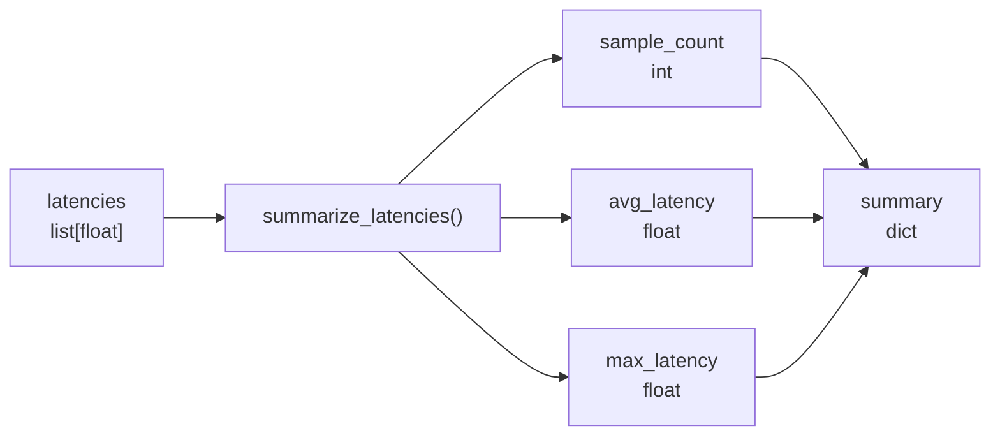

# Day 17 학습 노트 — AI Inference Latency 기초

## 1. 오늘 목표

여러 AI 요청의 처리 시간을 `list[float]`로 받고, 측정 개수·평균 latency·최대 latency를 요약하는 함수를 직접 구현하고 pytest로 검증했다.

## 2. Latency 정의

Latency는 **한 AI 작업이 시작된 순간부터 detection 결과가 준비될 때까지 걸린 시간**이다. 오늘 단위는 milliseconds(ms)다.

- `42.5ms`: 한 요청의 처리에 42.5ms가 걸렸다.
- accuracy: 결과가 맞는지
- latency: 결과가 얼마나 빨리 준비되는지

오늘은 network latency, API latency, GPU latency, throughput, FPS를 구분하거나 측정하지 않았다.

## 3. 공항 CCTV에서 필요한 이유

탐지 결과가 정확해도 늦게 준비되면 관제 화면과 알림은 현재보다 늦은 상황을 보여 준다. 따라서 운영자는 AI가 무엇을 찾았는지뿐 아니라, 그 결과가 얼마나 빨리 준비되는지도 확인해야 한다.

## 4. 개별 latency와 mock 데이터

```python
latencies = [42.0, 55.0, 48.0, 70.0, 45.0]
```

이 목록의 각 `float`는 AI 요청 한 번의 처리 시간(ms)이다. 예를 들어 `42.0`은 첫 번째 요청이 42ms에 처리됐다는 뜻이다.

## 5. avg latency와 max latency

- avg latency: 측정 구간에서 요청들이 보통 어느 정도 시간에 처리됐는지
- max latency: 그 구간에서 가장 오래 걸린 요청은 무엇인지

위 mock 데이터의 합은 `260.0`, 요청 수는 `5`이므로 avg latency는 `52.0ms`다. max latency는 `70.0ms`다.

평균만 보면 한 번만 크게 느려진 요청을 놓칠 수 있다. max는 그 측정 구간의 가장 느린 요청을 확인하게 해 준다. 단, max 하나만으로 기기 불량이나 서비스 오류를 확정할 수는 없다.

## 6. Data Flow



| 변수 | 자료형 | 역할 |
|---|---|---|
| `latencies` | `list[float]` | 여러 요청의 개별 latency(ms) |
| `sample_count` | `int` | 측정한 요청 개수 |
| `avg_latency` | `float` | 평균 처리 시간 |
| `max_latency` | `float` | 가장 오래 걸린 처리 시간 |
| `summary` | `dict` | latency 요약 결과 |

## 7. `summarize_latencies()` 계약

입력은 `latencies: list[float]`이고, 반환값은 다음 key를 가진 `dict`다.

```python
{
    "sampleCount": 5,
    "avgLatencyMs": 52.0,
    "maxLatencyMs": 70.0,
}
```

`latencies`는 계산 전의 개별 측정값이고, `summary`는 계산 후의 요약값이다. 따라서 mock list는 함수 안에 고정하지 않고 `main()`이나 pytest에서 만들어 함수 인자로 전달한다.

## 8. Empty List 처리

빈 리스트 `[]`에는 평균과 최대값이 존재하지 않는다. `0`은 실제로 0ms라는 측정값일 수 있으므로, 데이터가 없다는 뜻과 다르다.

따라서 빈 리스트는 계산 전에 `ValueError`로 처리한다. 이 검증이 없으면 평균 계산에서 0으로 나누거나 `max([])`가 실패한다.

## 9. 구현과 테스트

직접 작성한 파일:

- `week03/d17.py`: `summarize_latencies()`와 실행용 `main()`
- `week03/tests/test_d17.py`: Normal, Single Value, Empty List pytest
- `week03/d17_review.py`: 기존 코드를 보지 않고 같은 기능 복습 구현

pytest 결과:

```text
3 passed
```

테스트가 막는 문제:

- Normal: count·avg·max 또는 response key가 잘못 계산되는 문제
- Single Value: 값 하나일 때 avg와 max가 달라지거나 실패하는 문제
- Empty List: 측정값 없는 입력을 임의의 정상 summary로 처리하는 문제

## 10. DetectionResult와 latency

- `DetectionResult`: AI가 무엇을 찾았는지 나타내는 결과 데이터. 예: bbox, class, confidence
- latency: 그 결과를 만드는 데 걸린 처리 시간

둘은 별도 정보다. 정확한 detection 결과도 늦게 도착할 수 있고, 빠른 응답이 항상 객체를 탐지했다는 뜻은 아니다.

## 11. 선택 보너스 — `time.perf_counter()`

`week03/d17_bonus.py`에서 `convert_detections()` 한 번의 실행 시간을 측정했다.

```text
start → convert_detections(...) → end → (end - start) * 1000 → elapsed_ms
```

`perf_counter()`는 실행 시간 차이를 재기 적합한 초 단위 타이머다. 출력 예시는 `convert_detections latency: 0.055ms`처럼 실행할 때마다 달라질 수 있다.

이 값은 매우 단순한 mock 변환 함수 한 번의 시간일 뿐이다. 실제 YOLO 모델, GPU, API 전체, 실제 운영 환경의 성능으로 해석하지 않는다.

## 12. 면접용 설명

공항 CCTV AI는 정확한 detection 결과만으로 충분하지 않다. 결과가 늦게 준비되면 운영자는 과거 상황을 보게 되므로, avg latency로 보통의 처리 시간을 보고 max latency로 가장 느린 요청을 함께 확인한다.

## 13. 직접 구현한 부분과 한계

직접 구현한 부분은 latency summary 함수, 빈 리스트 검증, pytest 3개, 복습 구현, `perf_counter()` 기반의 단일 mock 호출 측정이다.

현재 범위의 한계는 p95, percentile, 반복 benchmark, 실제 YOLO, GPU, FastAPI middleware, monitoring dashboard를 구현하지 않았다는 점이다.

## 14. 다음 단계

Day 18에서는 다음으로 넘어가기 전에 latency의 정의, avg/max의 역할, `summarize_latencies()`의 입력·반환·empty 처리, DetectionResult와 latency의 차이를 다시 설명할 수 있어야 한다.

추천 커밋 메시지:

```text
feat: add latency summary practice and tests
```
