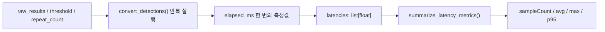

# Day 18 학습일지 — Latency p95와 반복 측정

## 오늘 목표

여러 번 측정한 latency를 `list[float]`로 수집하고, `avg`, `max`, `p95`를 포함한 summary `dict`로 요약한다.

## 구현한 파일

- `week03/d18.py`: p95 summary와 `convert_detections()` 반복 측정
- `week03/tests/test_d18.py`: normal, single, empty, repeat 측정 테스트
- `week03/d18_review.py`: 원본을 복사하지 않고 summary 함수 재구현

## 핵심 개념

- **avg latency**: 측정 구간 전체의 평균 처리시간
- **max latency**: 측정 구간에서 가장 느린 한 번의 처리시간
- **p95 latency**: 전체 측정값의 95%가 그 값 이하에 있는 경계값. 대부분 요청의 상단 latency를 보여 준다.

`p95`는 “상위 95%의 값”이나 “튀는 정도를 직접 계산한 값”이 아니다. 느린 요청이 있는지는 `avg`, `p95`, `max`를 함께 비교해 해석한다.

`np.percentile(latencies, 95)`는 숫자 목록에서 95번째 백분위 값을 반환한다. 작은 표본에서는 NumPy의 계산 방식에 따라 p95가 두 값 사이의 소수가 될 수 있다.

## Data Flow



`repeat_count`는 반복 횟수이고, 반복마다 `perf_counter()` 전후 차이를 ms로 변환해 `latencies`에 추가한다. summary 함수는 시간을 측정하지 않고 이미 수집된 목록을 요약만 한다.

## 함수 계약과 예외 처리

`summarize_latency_metrics(latencies: list[float]) -> dict`는 다음 키를 반환한다.

```python
{
    "sampleCount": ...,
    "avgLatencyMs": ...,
    "maxLatencyMs": ...,
    "p95LatencyMs": ...,
}
```

빈 리스트 `[]`는 측정값이 없다는 뜻이므로 `0ms`와 구분해야 한다. 따라서 계산 전에 `ValueError`로 처리한다.

## 테스트 결과

`pytest week03/tests/test_d18.py -q` 결과: **4 passed**

- Normal: 네 metric이 기대값과 일치하는지 확인
- Single: 하나의 latency에서 avg/max/p95가 모두 같은지 확인
- Empty: 빈 입력이 `ValueError`인지 확인
- Repeat: 요청한 반복 횟수만큼 0 이상 latency가 수집되는지 확인

## 실행 결과 해석

20회 mock 변환 측정에서 avg 약 `0.0034ms`, max 약 `0.0325ms`, p95 약 `0.0060ms`가 관측됐다. max가 p95보다 큰 것은 한두 번의 느린 실행이 있었을 수 있음을 보여 준다.

이 값은 작은 Python mock 변환 함수만 측정한 결과다. 실제 운영 latency에는 이미지 전처리, 모델 inference, API serialization, 네트워크, CPU/GPU 환경, 동시 요청이 포함된다.

## 공항 CCTV 서비스와 연결

`DetectionResult`는 AI가 무엇을 찾았는지 나타내는 결과 데이터이고, latency metric은 그 결과가 얼마나 빨리 준비됐는지 나타내는 성능 데이터다. 평균 latency가 낮아도 일부 요청이 반복적으로 느리면 사용자는 화면 지연이나 alert 지연을 경험할 수 있으므로 p95도 함께 확인한다.

## 면접용 설명

“avg latency는 전체적인 처리 경향을, max latency는 가장 느린 한 번을 보여 줍니다. p95 latency는 대부분 요청이 어느 정도 시간 안에 끝나는지 확인하기 위해 함께 봤습니다.”

“이번 실습에서는 mock 함수의 실행 시간을 반복 수집해 summary로 만들었습니다. 실제 서비스 지표로 사용하려면 모델 inference와 네트워크 등을 포함한 전체 요청 경로를 측정해야 합니다.”

## 다음 단계

Day 19 전에 avg/max/p95의 차이, `list[float]`에서 summary dict로 가는 흐름, 반복 측정 후 summary 전달 흐름을 다시 말로 설명할 수 있는지 확인한다.

추천 커밋 메시지:

```text
feat: add p95 latency metrics and repeated measurement practice
```
