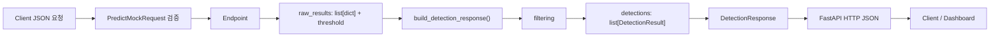

# Day 19 학습일지 — DetectionResponse와 Nested DTO

## 오늘 목표

여러 객체의 `DetectionResult`를 요청 단위의 `DetectionResponse`로 묶고, FastAPI가 이를 HTTP JSON으로 반환하는 흐름을 이해한다.

## 구현한 파일

- `week03/d19.py`: `DetectionResponse`, `build_detection_response()`, `POST /api/predict/mock`
- `week03/d19_review.py`: FastAPI 없이 같은 helper 흐름을 다시 구현
- `week03/tests/test_d19.py`: helper와 FastAPI 응답 계약 테스트

## 핵심 개념

- **raw_results**: filtering 전의 원본 후보 목록인 `list[dict]`
- **DetectionResult**: filtering 뒤 객체 하나를 검증된 DTO로 변환한 값
- **DetectionResponse**: 한 요청의 전체 결과. `detectionCount`, `confidenceThreshold`, `results`를 포함한다.

`results: list[DetectionResult]`는 아무 값이나 담는 list가 아니다. 각 원소가 `DetectionResult`의 `bbox`, `class_id`, `className`, `confidence` 계약을 만족해야 한다.

## Data Flow



filtering은 `list[dict]` 단계에서 일어난다. Day 16의 `convert_detections()`가 filtering한 뒤, 남은 dict를 `DetectionResult` 객체로 변환한다.

## DTO 계약

```python
class DetectionResponse(BaseModel):
    detectionCount: int = Field(ge=0)
    confidenceThreshold: float = Field(ge=0.0, le=1.0)
    results: list[DetectionResult]
```

`detectionCount`는 원본 후보 수가 아니라 `len(detections)`이다. threshold로 제외된 객체는 Dashboard에 반환하지 않으므로 count에도 포함하면 안 된다.

Pydantic DTO를 만들 때는 위치 인자가 아니라 `field_name=value` 형태를 사용한다. 왼쪽은 DTO 필드명이고, 오른쪽은 함수 안의 실제 값이다.

```python
DetectionResponse(
    detectionCount=detection_count,
    confidenceThreshold=threshold,
    results=detections,
)
```

## 책임 분리

- **Endpoint**: HTTP 요청을 받고, `PredictMockRequest`가 검증한 threshold를 꺼내 helper를 호출하고 응답을 반환한다.
- **build_detection_response()**: HTTP를 모르는 순수 Python 함수다. filtering 결과 변환, count 계산, 전체 response 생성을 담당한다.

Endpoint에서 filtering loop를 다시 작성하지 않았기 때문에 helper를 FastAPI 없이도 테스트하고 재사용할 수 있다.

## Server 객체와 HTTP JSON

서버 내부에서 helper는 `DetectionResponse` 객체를 반환한다. FastAPI는 이를 JSON object로 직렬화한다. TestClient에서 `response.json()`을 호출하면 다시 Python `dict`를 받는다.

```json
{
  "detectionCount": 1,
  "confidenceThreshold": 0.8,
  "results": [
    {
      "bbox": [120, 80, 300, 220],
      "class_id": 0,
      "className": "vehicle",
      "confidence": 0.87
    }
  ]
}
```

## 테스트 결과

`python -m pytest week03/tests/test_d19.py -v` 결과: **5 passed**

- Helper threshold `0.8`: vehicle 하나만 남고 count가 1인지 확인
- Helper threshold `0.7`: vehicle과 person이 모두 남고 count가 2인지 확인
- Endpoint threshold `0.8`, `0.7`: HTTP JSON 응답 계약 확인
- Invalid threshold `1.1`: Request DTO validation으로 `422`가 반환되는지 확인

## 공항 CCTV 서비스와 연결

Camera Frame에서 AI가 여러 후보를 만들고, filtering 뒤 여러 `DetectionResult`를 `DetectionResponse` 하나에 담아 Dashboard에 보낸다. Dashboard는 객체마다 별도의 HTTP 응답을 받을 필요 없이, 한 요청의 count와 threshold, 결과 목록을 함께 사용해 화면을 표시할 수 있다.

## Day 18 latency와의 관계

`DetectionResponse`는 탐지 결과 데이터이고, Day 18 latency metrics는 성능 데이터다. 나중에 `latencyMetrics`를 response에 추가할 수 있지만, 오늘은 nested result response 계약에만 집중했으므로 구현하지 않았다.

## 면접용 설명

“객체 하나는 `DetectionResult`로 표현하고, 요청 전체 결과는 count, threshold, 여러 객체 결과를 포함한 `DetectionResponse`로 분리했습니다. Endpoint는 HTTP 연결만 담당하고, filtering과 DTO 조립은 순수 helper로 분리해 service-level 테스트를 먼저 작성했습니다.”

## 다음 단계

Day 20 전에는 `list[dict] → filtering → list[DetectionResult] → DetectionResponse`와 Endpoint/helper의 책임 차이를 말로 설명할 수 있어야 한다.

추천 커밋 메시지:

```text
feat: add nested detection response practice
```
