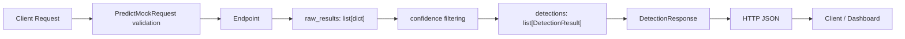

# Day 20 학습일지 — Week 6 통합 복습과 DetectionResponse 흐름

## 오늘 목표

Day 16~19에서 만든 부품을 다시 조합해, Client 요청부터 HTTP JSON 응답까지의 AI Vision mock pipeline을 요구사항만 보고 구성한다. 새 모델 기능을 추가하지 않고, DTO·Endpoint·helper의 책임과 자료형 경계를 복습한다.

## 구현한 파일

- `week03/d20.py`: `POST /api/predict/mock` 통합 Endpoint
- `week03/tests/test_d20.py`: 정상 1건, 정상 다건, validation 실패 API 테스트
- `week03/d20_review.py`: FastAPI 없이 기존 helper를 재사용해 흐름을 확인하는 복습 파일

## 구현 내용

`d20.py`는 Day 15의 `PredictMockRequest`와 Day 19의 `DetectionResponse`, `build_detection_response()`를 import해 재사용한다.

Endpoint는 Client가 보낸 `confidenceThreshold`를 꺼내고, 3개의 mock raw detection을 만든 뒤, 기존 helper에 전달한다. filtering, `DetectionResult` 변환, `detectionCount` 계산, `DetectionResponse` 조립은 Endpoint 안에서 다시 구현하지 않는다.

```text
Endpoint의 책임
요청 DTO 수신 → threshold 추출 → raw mock data 준비 → helper 호출 → HTTP 응답 반환

helper의 책임
confidence filtering → list[DetectionResult] 변환 → DetectionResponse 조립
```

## 기능 데이터 흐름



## 자료형 경계

| 변수 | 자료형 | 역할 |
|---|---|---|
| `request` | `PredictMockRequest` | Client 요청 body와 threshold 범위를 검증하는 DTO |
| `threshold` | `float` | filtering 기준값 |
| `raw_results` | `list[dict]` | mock 모델이 만든 여러 raw 후보 |
| `raw_detection` | `dict` | raw 후보 하나 |
| `filtered_results` | `list[dict]` | threshold를 통과했지만 아직 DTO 변환 전인 후보 목록 |
| `detection` | `DetectionResult` | 변환된 탐지 결과 하나 |
| `detections` | `list[DetectionResult]` | 변환된 탐지 결과 목록 |
| `response_model` | `DetectionResponse` | 한 요청 전체를 표현하는 서버 내부 DTO |
| `response.json()` | `dict` | Client/TestClient가 HTTP JSON을 읽은 결과 |

`DetectionResponse`는 목록이 아니라 한 요청의 단일 응답 객체다. 내부의 `results` 필드가 `list[DetectionResult]`이다.

## Pydantic 객체와 JSON 접근 차이

서버 내부의 `response_model`은 Pydantic 객체이므로 점 표기법으로 필드에 접근한다.

```python
response_model.results[0].className
```

TestClient가 `response.json()`으로 읽은 값은 Python `dict`이므로 key와 list index를 대괄호로 접근한다.

```python
body["results"][0]["className"]
```

- `.`: Pydantic 객체의 필드 접근
- `["key"]`: dict의 key 접근
- `[0]`: list의 순서 접근

## Threshold별 결과 예측

| threshold | detectionCount | 남는 className |
|---:|---:|---|
| `0.8` | 1 | `vehicle` |
| `0.7` | 2 | `vehicle`, `person` |
| `0.5` | 3 | `vehicle`, `person`, `baggage` |
| `1.1` | HTTP 422 | 요청 DTO validation 단계에서 Endpoint 실행 전 실패 |

`1.1`은 `PredictMockRequest`의 `Field(ge=0.0, le=1.0)` 계약을 벗어나므로 helper까지 전달되지 않는다.

## 테스트 결과

`python -m pytest week03/tests/test_d20.py -v` 결과: **3 passed**

- threshold `0.8`: HTTP 200, count 1, `vehicle` 한 건 확인
- threshold `0.5`: HTTP 200, `results`에 3개의 nested 탐지 결과 확인
- threshold `1.1`: 요청 DTO validation으로 HTTP 422 확인

## d20_review.py 실행

FastAPI와 `TestClient` 없이 raw data와 threshold를 helper에 전달해 response를 확인했다.

```text
python -m week03.d20_review

출력
1
vehicle
```

이 복습은 빈 화면에서 FastAPI 전체를 다시 작성하는 것이 아니라, 이미 만든 `build_detection_response()`에 어떤 입력을 조합해야 하는지 판단하는 연습이다.

## 기능 데이터와 성능 데이터 분리

```text
기능 데이터
Client Request → Request DTO → Endpoint → raw result → filtering
→ DetectionResult → DetectionResponse → HTTP JSON → Dashboard

성능 데이터
AI Processing → elapsed_ms 반복 측정 → list[float] → avg / max / p95
```

`DetectionResult`와 `DetectionResponse`는 무엇이 탐지됐는지 나타내는 기능 데이터다. `avg`, `max`, `p95`는 처리 시간이 얼마나 걸렸는지 나타내는 성능 데이터다. 두 흐름은 소비 목적과 측정 주기가 다르므로 현재는 하나의 DTO로 합치지 않는다.

## 공항 CCTV 서비스와 연결

공항 제한구역 CCTV라는 가정에서, Dashboard는 `className`, `bbox`, `confidence`, `detectionCount`, `confidenceThreshold`를 사용해 현재 frame의 탐지 결과를 표시할 수 있다. monitoring 영역은 별도로 avg/max/p95 latency를 사용해 처리 지연을 확인할 수 있다.

이번 구현은 실제 공항 운영 시스템이 아니라, 실제 서비스의 데이터 흐름을 단순화한 mock 실습이다. 실제 YOLO 모델, 이미지 업로드, OpenCV-FastAPI 연결, GPU inference, 인증, 운영 monitoring은 구현하지 않았다.

## 직접 작성과 Codex 도움 구분

- **직접 작성**: `d20.py`의 Endpoint 흐름, mock raw data, `test_d20.py`의 3개 API assertion, `d20_review.py`의 helper 재사용 및 실행
- **Codex 도움**: 자료형·책임 분리 설명, 코드 리뷰, import와 테스트 방향 힌트, 학습 노트 정리

## 면접용 설명

“Client 요청의 threshold는 Pydantic DTO에서 먼저 검증했습니다. Endpoint는 HTTP 요청을 받고 raw mock 결과를 helper에 전달하는 역할만 맡겼고, helper는 filtering 뒤 `DetectionResult` 목록을 만들고 `DetectionResponse`를 조립하도록 분리했습니다. FastAPI TestClient로 정상 결과와 validation 실패를 함께 검증했습니다.”

## Day 21 이동 전 확인

- raw dict와 `DetectionResult` DTO의 경계를 설명할 수 있는가?
- Endpoint와 helper를 분리한 이유를 설명할 수 있는가?
- `DetectionResponse`와 latency metrics가 다른 목적의 데이터임을 설명할 수 있는가?

추천 커밋 메시지:

```text
feat: add day 20 integration practice and tests
```
