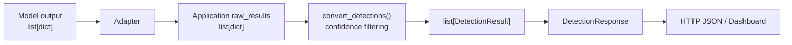

# Day 21 학습일지 — YOLO Model Output과 Service DTO의 경계

## 오늘 목표

실제 YOLO를 설치하지 않고, 가상의 모델 탐지 결과를 기존 AI Vision service pipeline이 사용할 수 있는 `raw_results`로 변환하는 adapter를 구현했다. 모델 결과 형식과 서비스 API 계약을 분리하는 이유를 설명하는 것이 핵심 목표였다.

## 구현 파일

- `week04/d21.py`: 모델 결과 1건을 서비스 raw detection 1건으로 바꾸는 `build_raw_detection()` 구현 및 기존 pipeline 연결
- `week04/d21_review.py`: adapter와 기존 `convert_detections()` 흐름을 다시 작성해 복습
- `week04/tests/test_d21.py`: field 변환과 threshold filtering 연결 테스트 2개

## 기존 Pipeline 복습

```text
Client
→ PredictMockRequest validation
→ FastAPI Endpoint
→ raw_results: list[dict]
→ confidence filtering
→ list[DetectionResult]
→ DetectionResponse
→ HTTP JSON / Dashboard
```

Day 21에서는 실제 모델이 연결되었을 때 `raw_results`를 만드는 앞부분에 adapter가 추가된다고 이해했다.



## 세 데이터 단계의 차이

| 단계 | 예시 | 책임 |
|---|---|---|
| Model / library output | `xyxy`, `class_name`, `class_id`, `confidence` | YOLO 같은 외부 모델 라이브러리가 반환하는 원본 결과 |
| Application raw detection | `bbox`, `className`, `class_id`, `confidence` | 우리 Python service가 필요한 정보만 담은 내부 `dict` |
| `DetectionResult` DTO | Pydantic 객체 | API와 Dashboard에 안정적으로 제공하는 서비스 계약 |

현재의 mock `raw_results`는 실제 YOLO 라이브러리의 원본 객체가 아니다. 학습을 위해 서비스가 필요한 값만 단순화한 `list[dict]` 데이터다.

## Adapter 구현

함수 이름은 `build_raw_detection()`으로 정했다.

```text
입력: model_detection: dict 1개
출력: raw detection: dict 1개
출력 field: bbox, class_id, className, confidence
```

변환 규칙은 다음과 같다.

```text
xyxy       → bbox
class_name → className
class_id   → class_id 유지
confidence → confidence 유지
```

adapter는 **모델 형식 변환만** 담당한다. `threshold`를 받거나 confidence filtering을 수행하지 않는다.

## Adapter와 Filtering의 책임 분리

```text
adapter
→ 모델/library 결과를 우리 service raw dict 형식으로 번역

filtering
→ 서비스의 confidence threshold 기준으로 표시할 결과를 선별
```

예를 들어 vehicle의 confidence가 `0.87`, person의 confidence가 `0.76`, threshold가 `0.8`이면 adapter 직후에는 raw detection이 2개다. 이후 `convert_detections()`가 filtering하여 `DetectionResult`는 vehicle 1개만 남긴다.

## Dependency Boundary

`DetectionResult`와 `DetectionResponse`는 모델 결과와 외부 API 사이의 dependency boundary를 만든다. 예를 들어 모델 라이브러리의 `class_name` key가 `label`로 바뀌면 adapter 내부에서 읽는 key만 수정하면 된다. 아래 요소는 유지한다.

- application raw detection의 `bbox`, `class_id`, `className`, `confidence`
- `convert_detections()`
- `confidenceThreshold`
- `DetectionResult`, `DetectionResponse`
- Dashboard가 기대하는 HTTP JSON 형식

따라서 특정 YOLO 라이브러리의 반환 형식이 바뀌어도 API 계약 전체가 같이 흔들리지 않는다.

## 정상 경계 사례

- 모델이 객체를 찾지 못한 경우는 오류가 아니다.
  - `model_detections = []`
  - `raw_results = []`
  - `detections = []`
  - `DetectionResponse.detectionCount = 0`
- 모델 결과에 필수 field인 `confidence`가 없으면 adapter에서 바로 발견하는 것이 좋다. 잘못된 모델 결과가 filtering과 API 응답까지 전달되지 않게 막는다.

## pytest 결과

`python -m pytest week04/tests/test_d21.py` 실행 결과: **2 passed**

1. `test_build_raw_detection_converts_required_fields`
   - `xyxy`, `class_name`이 `bbox`, `className`으로 정확히 변환되는지 검증
   - `className` 자리에 `class_id`를 잘못 넣는 bug를 방지
2. `test_adapter_output_connects_to_existing_detection_pipeline`
   - vehicle `0.87`, person `0.76`을 adapter로 변환한 뒤 threshold `0.8`을 적용
   - vehicle 1개의 `DetectionResult`만 남는지 검증

## 직접 구현한 부분과 Codex 지원

- **직접 구현**: `build_raw_detection()`의 field 추출·변환, list comprehension으로 여러 모델 결과 변환, 기존 `convert_detections()` 연결, pytest 2개 작성 및 실행
- **Codex 지원**: 단계별 함수 계약 정리, `dict`와 `list[dict]` 구분 피드백, 테스트 범위와 assertion 힌트, adapter/filtering 책임 분리 설명, 학습일지 정리

## 현재 범위와 한계

이번 구현은 가상의 model detection을 사용한다. 실제 YOLO 다운로드·inference, 이미지 preprocessing, NMS, IoU, ONNX, GPU, FastAPI image upload는 아직 구현하지 않았다.

실제 YOLO를 연결하면 image → preprocessing → YOLO inference → model output 부분과 adapter가 모델 결과를 읽는 부분만 추가 또는 변경한다. 기존 `convert_detections()`, `DetectionResult`, `DetectionResponse`는 재사용한다.

## 면접 설명

FastAPI 서비스는 요청을 받은 뒤 YOLO inference를 수행하고 모델 결과를 받는다. Adapter는 모델/library 결과에서 필요한 값을 꺼내 서비스 내부 `raw_results`를 생성한다. 이후 기존 filtering이 confidence 기준으로 표시할 결과를 고르고, `DetectionResult`와 `DetectionResponse`가 안정적인 API 계약으로 반환한다. 이 dependency boundary 덕분에 모델 라이브러리의 결과 형식이 바뀌어도 API와 Dashboard 계약을 유지할 수 있다.

## 다음 복습 포인트

- `dict` 1개와 `list[dict]` 여러 개를 구분하기
- adapter는 형식 변환, filtering은 비즈니스 기준 적용이라는 책임을 분리하기
- 실제 YOLO를 연결해도 pipeline의 어느 부분만 바뀌는지 설명하기

## 추천 Git Commit Message

```text
feat: add YOLO adapter practice and pipeline tests
```
