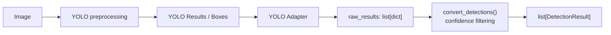

# Day 22 학습일지 — 실제 YOLO Result와 Service Adapter 연결

## 오늘 목표

실제 YOLO inference 결과가 Day 21의 Adapter 앞에 어떤 형태로 들어오는지 이해하고, 외부 YOLO 결과를 기존 service detection pipeline에 연결하는 작은 변환 함수를 구현한다.

## 구현 파일

- `week04/d22.py`: YOLO-style fields를 service `raw_results`로 바꾸는 `build_raw_detections_from_yolo_fields()` 구현
- `week04/d22_review.py`: Adapter → filtering → `DetectionResult` 흐름을 다시 작성해 복습
- `week04/tests/test_d22.py`: Adapter field 변환과 기존 pipeline 연결 테스트 2개

## 실제 YOLO Result와 mock data 차이

현재 환경에는 `ultralytics`가 설치되어 있지 않아 실제 inference는 실행하지 않았다. 공식 문서 기준으로 한 이미지 추론은 `list[Results]`를 반환하며, `result.boxes.xyxy`, `result.boxes.conf`, `result.boxes.cls`, `result.names`에서 필요한 정보를 찾는다. [Ultralytics Predict 문서](https://docs.ultralytics.com/modes/predict)

Day 21의 `raw_results`는 실제 YOLO Result가 아니다. 실제 Result는 library object와 tensor 값을 포함하고, `raw_results`는 우리 service가 정한 `list[dict]` 중간 계약이다.

## 기능 데이터 흐름



Adapter는 모든 detection을 service raw dict로 변환한다. threshold `0.8`에서 `0.91`, `0.72` confidence가 들어오면 Adapter 직후에는 2개이고, filtering 뒤에는 `0.91` 한 개만 남는다.

## 자료형 경계

| 단계 | 자료형/예시 | 책임 |
|---|---|---|
| OpenCV image | `np.ndarray`, `(H, W, C)` BGR image | 이미지 픽셀을 메모리에 표현 |
| YOLO Result | `Results`와 `Boxes` library object | 모델이 탐지 결과를 보관 |
| YOLO fields | `xyxy`, `cls`, `conf`, `names` | bbox, class id, confidence, class name 조회 |
| `raw_results` | `list[dict]` | service가 filtering 전에 사용하는 공통 계약 |
| `DetectionResult` | Pydantic DTO | 검증된 탐지 결과를 API 계층에 전달 |

실제 YOLO의 bbox와 class id는 float/tensor일 수 있다. 현재 `DetectionResult.bbox`가 `list[int]`이므로 Adapter에서 bbox와 class id를 `int`로 변환했다. 이 선택은 기존 DTO를 유지하지만, bbox 소수점 정밀도를 잃을 수 있다.

## Adapter 구현과 책임 분리

`build_raw_detections_from_yolo_fields()`는 `zip()`으로 같은 index의 bbox, class id, confidence를 한 detection으로 묶는다. class id를 정수로 바꾼 뒤 `names` dict에서 class name을 찾아 Day 21의 `build_raw_detection()`에 전달한다.

```text
YOLO-style fields
→ Adapter: field 추출, type/key mapping, raw_results 생성
→ convert_detections(): threshold filtering, DetectionResult 생성
```

Adapter는 threshold를 받거나 filtering하지 않는다. 따라서 실제 YOLO library가 바뀌면 우선 Adapter의 외부 field 읽기 부분만 수정하고, `raw_results` 계약과 `convert_detections()`는 재사용할 수 있다.

## pytest 결과

`python -m pytest week04/tests/test_d22.py` 실행 결과: **2 passed**

1. `test_yolo_fields_are_converted_to_raw_results`
   - 두 detection의 bbox, class id, class name, confidence가 service raw dict로 변환되는지 확인
   - bbox float → int 변환과 반복문 밖 `append()`로 마지막 결과만 남는 bug를 방지
2. `test_adapter_output_connects_to_convert_detections`
   - Adapter 결과를 threshold `0.8`로 filtering해 `person` 1건만 `DetectionResult`가 되는지 확인
   - raw dict key가 기존 pipeline 계약과 달라지는 bug를 방지

## d22_review.py 실행

복습 파일에서는 confidence `0.93`, `0.65`인 두 detection을 변환했다. Adapter 직후에는 raw dict가 2개이고, threshold `0.8` 이후 `person` 1개가 남는 것을 확인했다.

```text
python -m week04.d22_review

출력
raw_results 2개
DetectionResult 1개
person
```

## 직접 작성과 Codex 도움 구분

- **직접 작성**: `zip()` 반복, bbox/class id 정수 변환, names mapping, `raw_results.append()`, pytest assertion 2개, review 파일 실행
- **Codex 도움**: 공식 Result 구조 확인, 함수 계약과 TODO 단계화, 자료형 경계·Adapter 책임 설명, 테스트와 학습일지 검토

## 현재 범위와 한계

실제 YOLO model download, training, fine-tuning, FastAPI image upload, ONNX, GPU 최적화는 진행하지 않았다. `ultralytics` 미설치 환경에서는 simplified YOLO fields로만 Adapter 경계를 검증했다. 현재 int bbox 정책은 정확한 float 좌표가 필요한 API에는 적합하지 않을 수 있다.

## 면접용 설명

“YOLO library의 `Results` object를 API까지 직접 전달하지 않고, Adapter에서 service raw contract로 변환했습니다. Adapter는 모델 형식과 자료형 변화만 흡수하고, 기존 `convert_detections()`는 confidence filtering과 `DetectionResult` 생성 책임을 유지합니다. 따라서 모델 library 교체 시 변경 범위를 Adapter 중심으로 제한할 수 있습니다.”

## 다음 복습 포인트

- 실제 YOLO Result object와 `dict`를 구분해 필요한 field를 찾기
- Adapter의 형식 변환과 filtering의 정책 결정을 분리하기
- 실제 모델을 연결해도 유지할 service raw contract와 DTO를 설명하기

## 추천 Git Commit Message

```text
feat: YOLO 결과를 서비스 Detection 파이프라인에 연결
```
